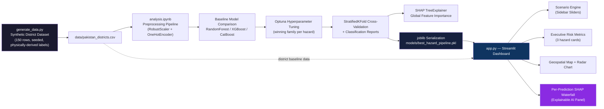

# 🛡️ Pakistan Multi-Hazard Risk Analyzer

**Explainable AI for Proactive Disaster Risk Assessment — Floods, Heatwaves & Seismic Events Across 150+ Pakistani Districts**

[](https://www.python.org/)
[](https://streamlit.io/)
[](https://catboost.ai/)
[](https://optuna.org/)
[](https://shap.readthedocs.io/)
[](LICENSE)

---

## Executive Summary

NDMA's stated mandate under Lieutenant General Inam Haider Malik is a shift **"from counting losses to calculating solutions"** — predictive sovereignty over disaster response rather than reactive relief. This project is a working demonstration of that shift applied to a concrete, scoped problem: given a district's physical and climatic profile, can a model estimate flood, heatwave, and seismic risk *before* the event, with its reasoning made fully transparent to a policy decision-maker who is not a data scientist?

This is a **portfolio-grade proof of concept**, not a production NDMA system. It is built on synthetic, physically-grounded data (see [Data Disclosure](#data-disclosure)) and is intended to demonstrate applied ML/XAI competency directly relevant to the Assistant Manager (AI/ML) — PPS-7 role: model development, GIS-aware feature engineering, hyperparameter optimization, and — critically — explainability suited to government-grade accountability.

**What it does:**
- Classifies flood, heatwave, and seismic risk (Low / Medium / High) for 150 Pakistani districts across all 7 provinces/territories
- Lets a user simulate climate scenarios (raise rainfall, drop elevation, etc.) and see risk predictions update live
- Explains *every single prediction* with SHAP — showing exactly which feature, and by how much, drove the model's decision

---

## Why Explainable AI Is Non-Negotiable for Government Use

A black-box model that says "District X is High Risk" is operationally useless and politically indefensible for a government agency. If NDMA reallocates emergency funding, issues an evacuation advisory, or deprioritizes a district based on a model's output, that decision must be **auditable** — a policymaker, a journalist, or a parliamentary committee can reasonably ask *"why does the model say this district is high-risk?"*, and "the algorithm decided" is not an acceptable answer.

This project integrates **SHAP (SHapley Additive exPlanations)** at the prediction level, not just at the global feature-importance level:

- Every single prediction — not just the model in aggregate — gets a waterfall breakdown showing which features pushed the risk score up or down, and by how much, in the model's actual mathematical units (Shapley values, which sum exactly to the difference between the prediction and the model's average output).
- Feature contributions are displayed in **original human-readable units** (e.g., "Elevation = 4009m, contribution +0.82") rather than scaled/transformed values, so a non-technical reviewer can sanity-check the reasoning against domain knowledge.
- This turns "the model says High risk" into **"the model says High risk primarily because of elevation and historical earthquake frequency"** — a claim a policymaker can interrogate, and that a technical reviewer can defend in an audit.

This is the same standard applied in credit risk, medical diagnosis, and other high-stakes regulated domains where an unexplainable model is a liability regardless of its accuracy.

---

## Architecture



**Data lifecycle in one sentence:** synthetic district data is generated once, trained into three hazard-specific CatBoost pipelines tuned by Optuna and validated with stratified cross-validation, serialized as a single joblib bundle, then loaded by a Streamlit dashboard that lets a user run live "what-if" scenarios and see a mathematically grounded explanation for every prediction.

---

## Repository Structure

```text
pakistan-multi-hazard-risk-analyzer/
│
├── app.py                          # Streamlit XAI dashboard (entry point)
├── generate_data.py                # Synthetic dataset generator (seed=42, reproducible)
├── analysis.ipynb                  # Full ML pipeline: EDA → tuning → SHAP → serialization
├── requirements.txt                # Pinned dependencies (backend + frontend)
├── README.md                       # This file
├── LICENSE                         # MIT License
├── .gitignore
│
├── data/
│   └── pakistan_districts.csv      # 150 districts × 19 columns (synthetic)
│
├── models/
│   └── best_hazard_pipeline.pkl    # Serialized bundle: 3 tuned pipelines + metadata
│
└── images/
    ├── risk_by_province.png
    ├── correlation_heatmap.png
    ├── geospatial_risk_scatter.png
    ├── feature_boxplots_by_province.png
    ├── feature_distributions.png
    ├── confusion_matrices.png
    └── shap_feature_importance.png
```

---

## Model Performance

Three independent CatBoost classifiers (selected via baseline comparison against RandomForest and XGBoost, then tuned with Optuna — 30 trials each) evaluated with stratified 5-fold cross-validation and macro-averaged F1 (appropriate given the intentional class imbalance — "High" risk is a minority class by design, matching real-world disaster label distributions):

| Hazard | Winning Model | Baseline Macro-F1 | Tuned Macro-F1 |
|---|---|---|---|
| Flood Risk | CatBoost | 0.702 | **0.716** |
| Heatwave Risk | CatBoost | 0.572 | **0.665** |
| Seismic Risk | CatBoost | 0.761 | **0.791** |

SHAP analysis confirms the models recovered physically sensible relationships without being explicitly told them: rainfall and river proximity dominate flood risk, summer temperature and vegetation index dominate heatwave risk, and elevation and seismic history dominate earthquake risk — matching real geophysical expectations for Pakistan's provinces.

---

## Explainable AI in the Dashboard

The **"Why This Prediction?"** panel is the core interview-defensible feature of this project. For whichever hazard is predicted highest-risk in the current scenario, the dashboard renders a live SHAP waterfall plot showing:

- The model's average baseline prediction (starting point)
- Each feature's individual contribution, in original units, ranked by magnitude
- The final prediction as the sum of the baseline plus every contribution — the actual Shapley decomposition, not an approximation

This means every "High Risk" label the dashboard produces comes with a mathematically grounded, feature-level justification, generated on-demand for the exact scenario the user constructed — not a static, pre-computed explanation.

---

## Usage

### Local Setup

```bash
git clone https://github.com/<your-username>/pakistan-multi-hazard-risk-analyzer.git
cd pakistan-multi-hazard-risk-analyzer

python3 -m venv venv
source venv/bin/activate          # Windows: venv\Scripts\activate

pip install -r requirements.txt
```

### Regenerate Data & Retrain Models (optional — pre-trained bundle is included)

```bash
python generate_data.py
jupyter nbconvert --to notebook --execute analysis.ipynb --output analysis.ipynb
```

### Run the Dashboard

```bash
streamlit run app.py
```

Then open `http://localhost:8501` in your browser.

### Deploy to Streamlit Community Cloud

1. Push this repository to GitHub
2. Go to [share.streamlit.io](https://share.streamlit.io) → New app
3. Select this repo, branch `main`, main file `app.py`
4. Deploy — `models/` and `data/` are committed to the repo (not gitignored), so the app boots with no extra setup

---

## ⚠️ Data Disclosure

The dataset (`data/pakistan_districts.csv`) is **synthetically generated**, not measured/observed data. District names, provinces, and general geographic positioning are real; feature values (rainfall, elevation, population density, historical event counts) are simulated from province-conditioned statistical distributions built to approximate real Pakistani geography, then risk labels are derived from a weighted, noisy function of those features so relationships are physically plausible rather than arbitrary. This is disclosed explicitly because misrepresenting synthetic data as real is not something this project does, on the record or in an interview.

The generation methodology (province-conditioned sampling, deliberate outlier injection, minority-class risk labeling) is itself part of the technical demonstration — see `generate_data.py` for full implementation.

---

## Strategic Roadmap — Path to Production

This architecture is deliberately built so each synthetic component has a clear, scoped real-data replacement path:

| Phase | Component | Current (POC) | Production Path |
|---|---|---|---|
| **Phase 2** | Data Ingestion | Static synthetic CSV | Live ingestion from PMD (Pakistan Meteorological Department) API + SUPARCO satellite feeds, refreshed on a scheduled pipeline (Airflow/cron) |
| **Phase 2** | Geospatial Layer | Lat/lon scatter plot | Full GIS integration — Folium/Leaflet choropleth over real district shapefiles, consistent with NDMA's GIS Disaster Intelligence Platform |
| **Phase 3** | Imagery | Not covered in this project (see companion Satellite Flood Detector) | Direct ingestion of PRSC-EO1 satellite tiles for automated post-event damage classification, feeding risk labels back into this model as ground truth |
| **Phase 3** | Model Monitoring | One-time training run | Scheduled retraining pipeline with drift detection — flood/heatwave risk relationships shift with climate change and cannot be trained once and left static |
| **Phase 4** | Alerting | Dashboard only (pull-based) | Push-based integration with NEOC Digital Dashboards and DEW-2 early warning triggers when a district crosses a High-risk threshold |
| **Phase 4** | Validation | Synthetic labels | Backtesting against the 2022 flood PDNA (Post-Disaster Needs Assessment) dataset and historical NDMA advisories to calibrate real-world label accuracy |

The core engineering pattern — preprocessing pipeline → per-hazard tuned model → SHAP-explained serving layer — does not change between the POC and production; only the data source and deployment cadence do. That separation of concerns is intentional.

---

## Tech Stack

**ML/Backend:** Python, scikit-learn, CatBoost, XGBoost, RandomForest, Optuna, SHAP, joblib
**Frontend:** Streamlit, Plotly
**Data:** Pandas, NumPy

---

## Author

Developed by **Asad Amin** — AI/ML Engineer.
*Specializing in predictive analytics, geospatial intelligence, and Explainable AI (XAI) for proactive disaster management.*

## License

MIT — see [LICENSE](LICENSE).
